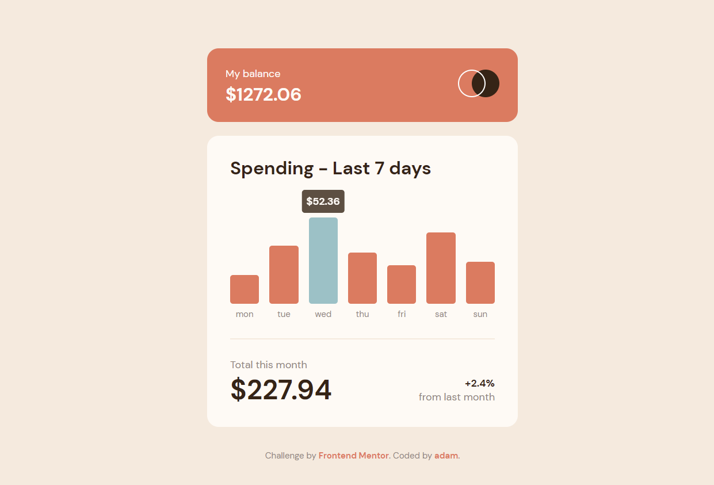

# Frontend Mentor - Expenses chart component solution

This is a solution to the [Expenses chart component challenge on Frontend Mentor](https://www.frontendmentor.io/challenges/expenses-chart-component-e7yJBUdjwt). Frontend Mentor challenges help you improve your coding skills by building realistic projects.

## Table of contents

- [Overview](#overview)
  - [The challenge](#the-challenge)
  - [Screenshot](#screenshot)
  - [Links](#links)
- [My process](#my-process)
  - [Built with](#built-with)
  - [What I learned](#what-i-learned)
- [Author](#author)

## Overview

### The challenge

Users should be able to:

- View the bar chart and hover over the individual bars to see the correct amounts for each day
- See the current day’s bar highlighted in a different colour to the other bars
- View the optimal layout for the content depending on their device’s screen size
- See hover states for all interactive elements on the page
- **Bonus**: Use the JSON data file provided to dynamically size the bars on the chart

### Screenshot



### Links

- Solution URL: [Add solution URL here](https://github.com/adamdotjs/expenses-chart)
- Live Site URL: [Add live site URL here](https://your-live-site-url.com)

## My process

### Built with

- HTML
- CSS
- Vanilla JavaScript

### What I learned

I wanted to see if I could leverage CSS custom properties and a single media query to handle resizing of elements/spacing. It ended up working quite well but did feel a little clunky. I'd want to revisit this in the future with a better design system in place.

I learned how to get the highest value from an array using Math.max() -- I really love how simple it was to use.

```js
const isHighestSpend = (data) => {
	const values = data.map((value) => value.amount);
	return Math.max(...values);
};
```

## Author

- Website - [Adam Shea](https://adamjs.dev)
- Frontend Mentor - [@adamdotjs](https://www.frontendmentor.io/profile/adamdotjs)
- Twitter - [@adamdotjs](https://www.twitter.com/adamdotjs)
